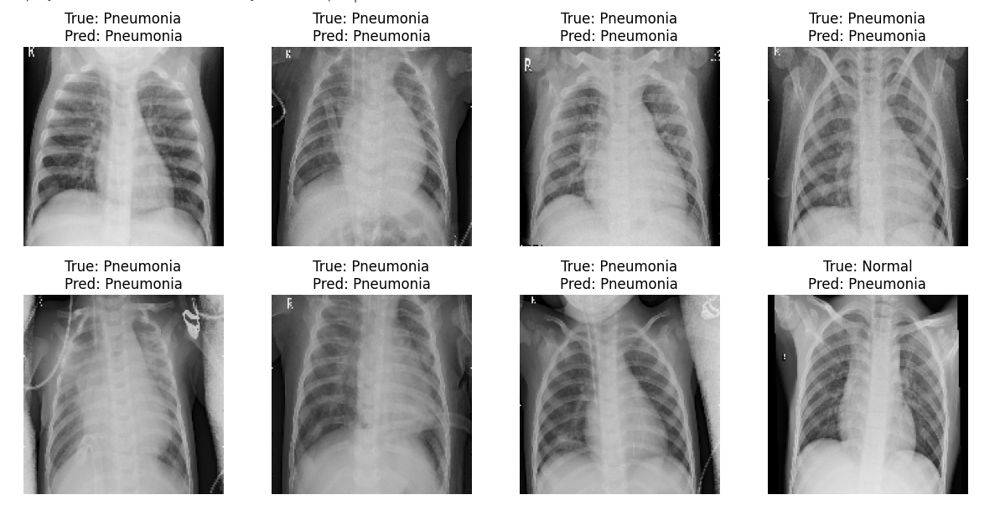

# Medical Image Classification with ResNet

This project aims to classify chest X-ray images into two categories: **Normal** and **Pneumonia** using transfer learning with the **ResNet** architecture. The project leverages pre-trained models to perform binary classification and achieves robust results on the Chest X-ray dataset.



## Project Structure

The repository consists of the following key components:

- `src/`: Python scripts for data preprocessing, model building, and evaluation.
- `data/`: Contains the X-ray images, organized into training, validation, and test sets.
- `images/`: Stores visualizations such as accuracy and loss plots, along with sample prediction results.
- `notebooks/`: Jupyter notebooks for model training and visualization of results.

## Dataset

The dataset used in this project is a collection of X-ray images divided into two categories:
1. **Normal**: X-rays of healthy lungs.
2. **Pneumonia**: X-rays of lungs with pneumonia infection.

## Model

This project uses **ResNet50**, a pre-trained deep learning model, for transfer learning. We fine-tune the network by adding custom classification layers to fit the binary classification problem.

### Model Architecture

1. **ResNet50**: Pre-trained base model excluding the final layers.
2. **Fully Connected Layers**: Custom layers added for binary classification.
   - GlobalAveragePooling2D to reduce the dimensions.
   - Two Dense layers with ReLU activation.
   - Output layer with a sigmoid activation for binary classification.

### Results

The trained model achieved the following performance metrics:
- **Test Accuracy**: ` 0.4548`
- **Test Loss**: `79.97%`

You can view more details of the model's performance in the [Jupyter notebook](notebooks/model_evaluation.ipynb) or by exploring the [images folder](images/).

### Interpretation:

The model achieved a test accuracy of approximately 80%, meaning it correctly classified 80% of the test images as either normal or pneumonia. A test loss of 0.4548 reflects the degree of error in the model's predictions, with lower values indicating a better model fit. While these results are promising, there's room for improvement through further fine-tuning or the use of more complex models.

## Usage

1. **Install the dependencies**: 
    ```bash
    pip install -r requirements.txt
    ```
2. **Train the model**: 
    - Run the script in the `src/` directory or explore the Jupyter notebook for step-by-step guidance.
3. **View results**: 
    - Check the `images/` folder for model performance visualizations.

## Conclusion

This project demonstrates the power of transfer learning in medical image classification using the ResNet architecture. By fine-tuning a pre-trained model, we achieve significant results with limited data and computational resources.

Feel free to contribute or suggest improvements to this project!

